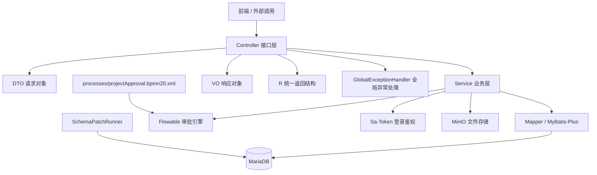
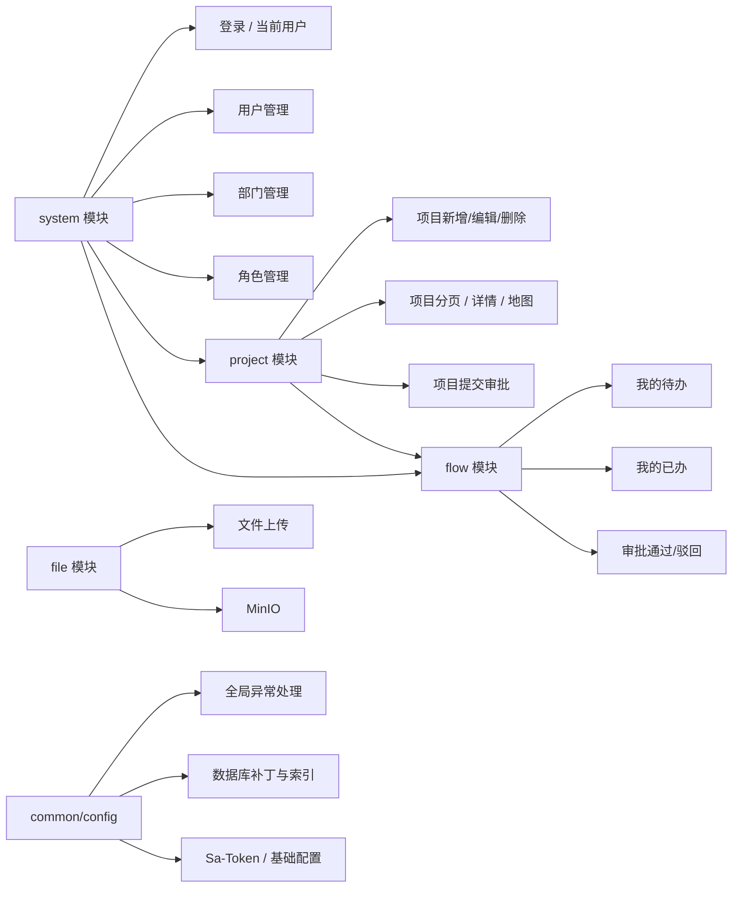
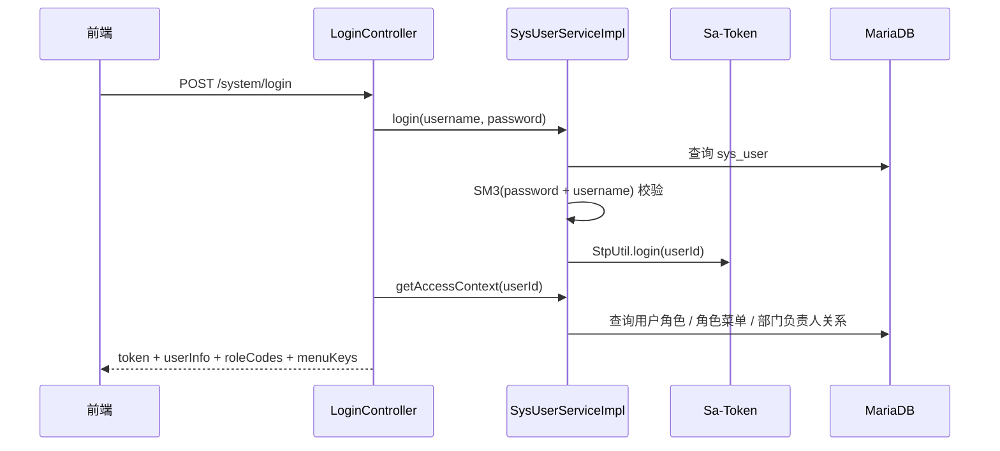
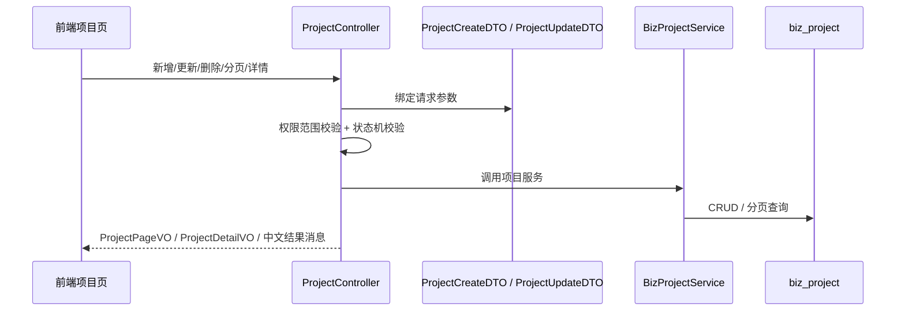
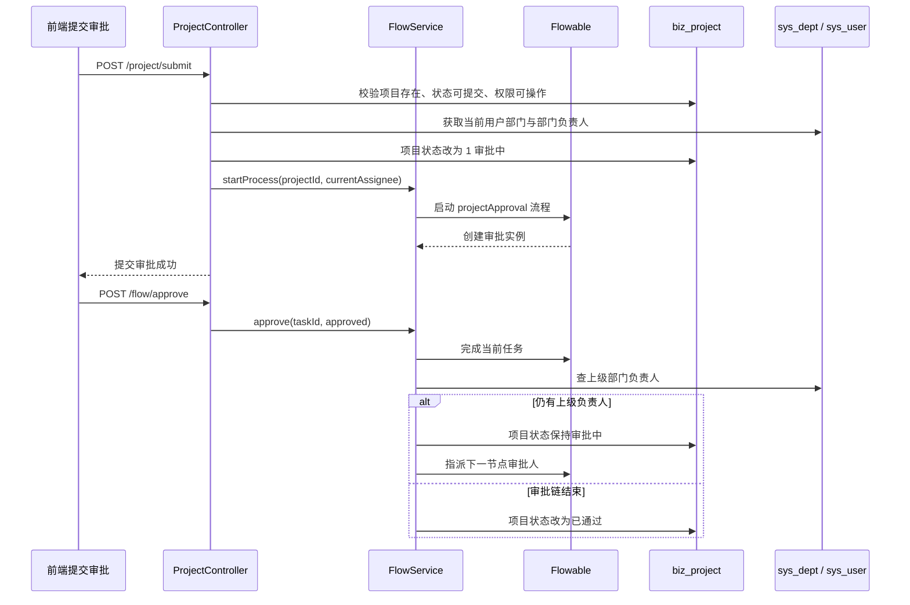
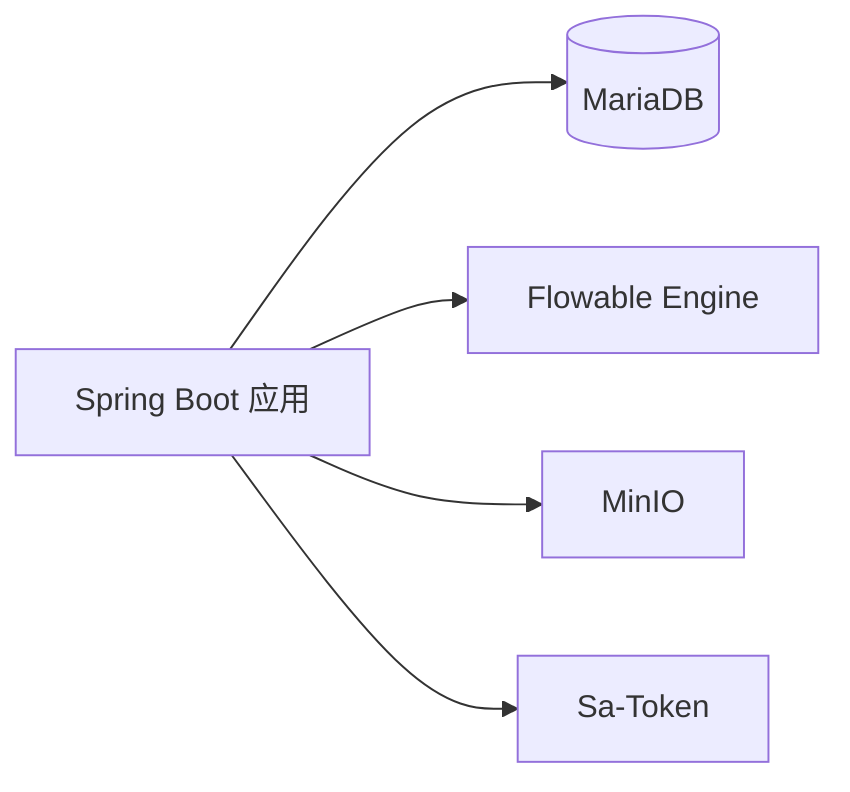

# 后端架构总览

## 1. 整体分层图



## 2. 模块拆分图



## 3. 核心目录职责

```text
src/main/java/com/gov/
├─ common/
│  ├─ result/R.java                 统一响应包装
│  └─ exception/GlobalExceptionHandler.java
├─ config/
│  └─ SchemaPatchRunner.java        启动时索引/补丁执行
├─ module/
│  ├─ system/
│  │  ├─ controller/                登录、用户、部门、角色接口
│  │  ├─ dto/                       用户/部门/角色请求 DTO
│  │  ├─ entity/                    系统实体
│  │  ├─ mapper/                    MyBatis-Plus Mapper
│  │  ├─ service/                   系统业务服务
│  │  └─ vo/                        用户/角色/部门响应 VO + 访问上下文
│  ├─ project/
│  │  ├─ controller/                项目接口
│  │  ├─ dto/                       项目请求 DTO
│  │  ├─ entity/                    项目实体
│  │  ├─ mapper/                    项目 Mapper
│  │  ├─ service/                   项目服务
│  │  └─ vo/                        项目分页/详情/地图/审批任务 VO
│  ├─ flow/
│  │  ├─ controller/                待办、已办、审批接口
│  │  └─ service/                   Flowable 审批流推进
│  └─ file/
│     └─ controller/                MinIO 上传接口
└─ GovApplication.java

src/main/resources/
├─ application.yml                  数据库、MinIO、Flowable、Sa-Token 配置
└─ processes/
   └─ projectApproval.bpmn20.xml    项目审批流程定义
```

## 4. 认证与权限链路



### 权限判定要点

- 登录态由 Sa-Token 托管，前端通过 `Authorization` 头传 token。
- `UserAccessContext` 是当前后端权限收口核心，统一包含：
  - `userId`
  - `deptId`
  - `roleIds`
  - `roleCodes`
  - `menuKeys`
  - `isAdmin`
  - `isDeptLeader`
- 管理员看全量数据。
- 部门负责人看本部门范围数据。
- 普通用户只看自己创建的数据。

## 5. 项目与审批主链路

### 项目 CRUD 与分页



### 提交审批与逐级流转



## 6. 数据与接口契约

### 输入契约

- Controller 请求体已按 DTO 分离，不再直接拿实体接收高频写接口。
- 代表性 DTO：
  - `ProjectCreateDTO / ProjectUpdateDTO / ProjectSubmitDTO`
  - `UserCreateDTO / UserUpdateDTO / UserStatusUpdateDTO / UserRoleAssignDTO`
  - `RoleCreateDTO / RoleUpdateDTO / RoleMenuUpdateDTO`
  - `DeptCreateDTO / DeptUpdateDTO`

### 输出契约

- 列表和详情接口已按 VO 收口，避免实体字段直接泄露。
- 代表性 VO：
  - `ProjectPageVO / ProjectDetailVO / ProjectMapVO`
  - `UserPageVO / UserSimpleVO`
  - `RolePageVO / RoleOptionVO`
  - `SysDeptTreeVO`
  - `FlowTaskVO`

### 统一返回

- 所有接口统一返回 `R(code, msg, data)`。
- `msg` 现在已经统一收口为中文，前端可直接展示。

## 7. 外部依赖图



## 8. 当前后端的关键约束

- 项目状态机固定：`0 待提交`、`1 审批中`、`2 已通过`、`3 已驳回`。
- 仅 `0/3` 状态允许编辑、删除、再次提交。
- 地图接口默认只返回已通过项目。
- 用户权限以角色码、菜单权限、部门负责人兜底三层组合判断。
- 启动阶段会通过 `SchemaPatchRunner` 做索引与补丁收敛。
