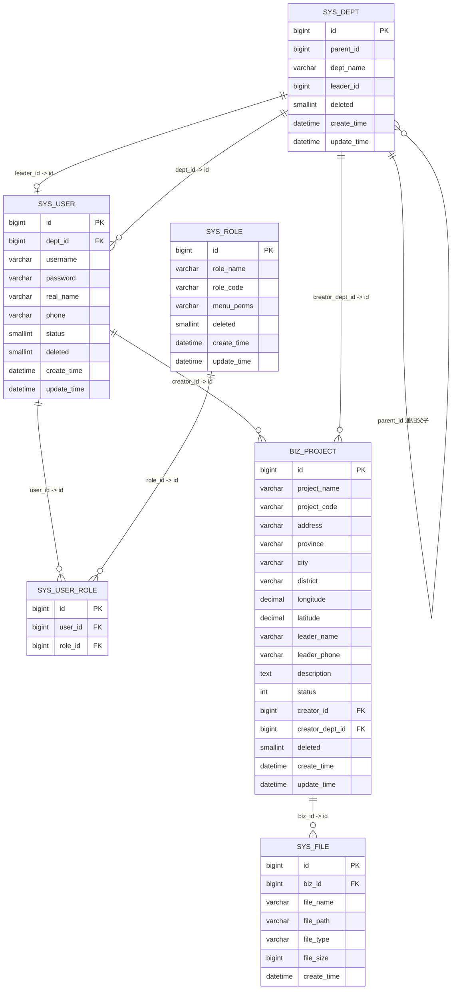
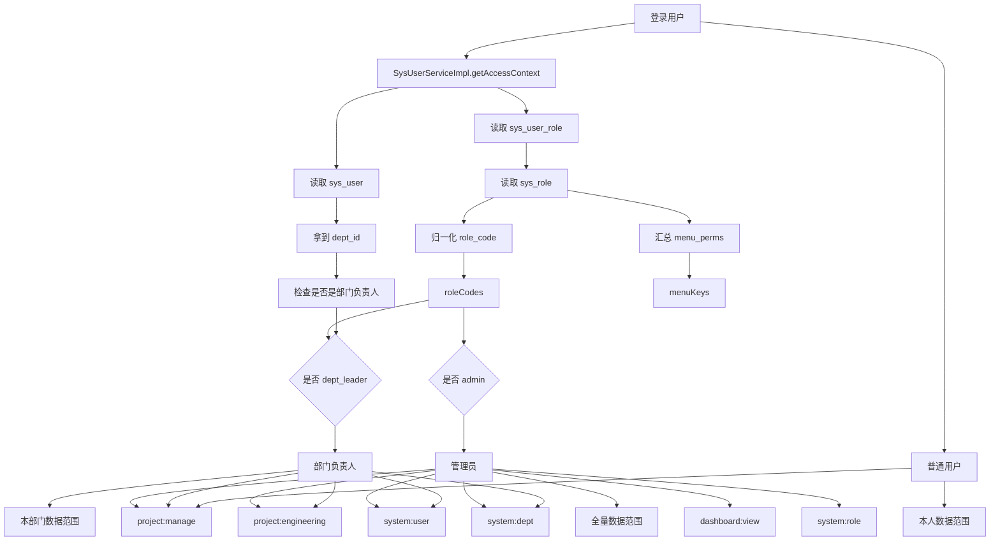
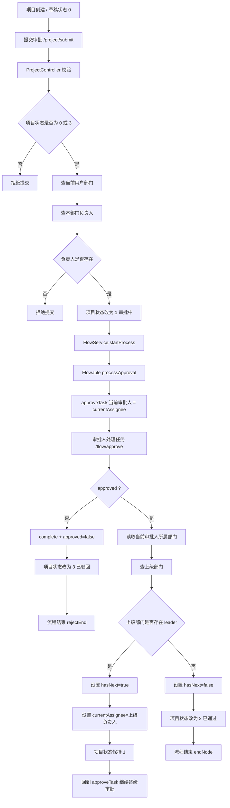

# 底层结构图

## 1. 数据库 ER 图

### ER 图阅读重点

- `sys_dept` 是树结构，`parent_id` 形成部门层级。
- `sys_user` 同时关联部门，部门又可通过 `leader_id` 指向负责人。
- `sys_user_role` 是用户和角色的多对多中间表。
- `biz_project` 把“创建人”和“创建部门”固化下来，后续分页、权限、地图和审批都依赖这两个字段。
- `sys_file` 目前是业务文件挂接点，`biz_id` 可关联项目等业务主键。

## 2. 权限关系图

### 权限关系图阅读重点

- 后端权限不是只看角色名，而是 `roleCodes + menuKeys + 部门负责人兜底识别` 三层组合。
- 如果角色没配置菜单权限，会按 `admin / dept_leader / user` 走默认菜单集。
- 列表数据范围与按钮权限不是一回事：
  - 菜单权限决定“能不能进页面”
  - 数据范围决定“进来后能看到谁、改谁”

## 3. 审批流程图

### 审批流程图阅读重点

- 审批链不是固定写死几级，而是“当前部门负责人 -> 上级部门负责人 -> 再上级负责人”的动态逐级流转。
- 驳回会直接结束流程并把项目状态改为 `3`。
- 没有更上级负责人时，本次同意就是终审通过，项目状态改为 `2`。
- 地图展示只认 `status=2`，所以审批是否结束会直接影响地图是否可见。
