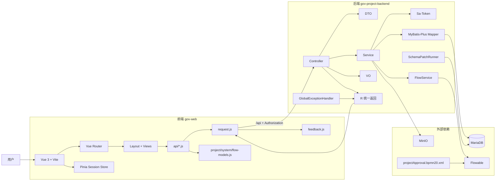

# 前后端联动总图

## 1. 总体架构图



## 2. 五条跨端主链路总图

```mermaid
flowchart TB
    A[1. 登录]
    A1[前端 login.vue]
    A2[session.js]
    A3[/system/login]
    A4[SysUserServiceImpl]
    A5[Sa-Token + UserAccessContext]
    A6[token + userInfo + roleCodes + menuKeys + homePath]

    B[2. 项目分页]
    B1[manage.vue 查询条件]
    B2[api/project.js]
    B3[/project/page]
    B4[ProjectController]
    B5[按权限范围查 biz_project]
    B6[ProjectPageVO 分页结果]

    C[3. 提交审批]
    C1[manage.vue 提交审批]
    C2[/project/submit]
    C3[ProjectController 状态/权限校验]
    C4[FlowService.startProcess]
    C5[Flowable 启动 projectApproval]
    C6[项目状态 0/3 -> 1]

    D[4. 审批通过 / 驳回]
    D1[engineering.vue 待办审批]
    D2[/flow/approve]
    D3[FlowService.approve]
    D4{approved?}
    D5[驳回 -> 项目状态 3]
    D6[同意 -> 查上级部门负责人]
    D7{还有上级审批人?}
    D8[有 -> 保持状态 1 并继续流转]
    D9[无 -> 项目状态 2]

    E[5. 地图展示]
    E1[dashboard.vue]
    E2[/project/map/list]
    E3[ProjectController]
    E4[仅查询 status=2 已通过项目]
    E5[ProjectMapVO]
    E6[ECharts 点位 / 下钻 / 详情]

    A --> A1 --> A2 --> A3 --> A4 --> A5 --> A6
    B --> B1 --> B2 --> B3 --> B4 --> B5 --> B6
    C --> C1 --> C2 --> C3 --> C4 --> C5 --> C6
    D --> D1 --> D2 --> D3 --> D4
    D4 -->|否| D5
    D4 -->|是| D6 --> D7
    D7 -->|是| D8
    D7 -->|否| D9
    E --> E1 --> E2 --> E3 --> E4 --> E5 --> E6
```

## 3. 直观看全局时的抓手

- 登录链路的核心交付物不是只有 token，而是 `token + userInfo + roleCodes + menuKeys + homePath`。
- 项目分页、详情、地图都受同一套权限边界控制：管理员全量，部门负责人看本部门，普通用户看自己。
- 项目状态机是全局主轴：`0 待提交 -> 1 审批中 -> 2 已通过 / 3 已驳回`。
- 审批中心和项目管理共享同一批项目数据，只是入口不同：一个偏 CRUD，一个偏 Flowable 任务。
- 地图看板不是独立数据源，本质上是“已通过项目”的投影视图。
